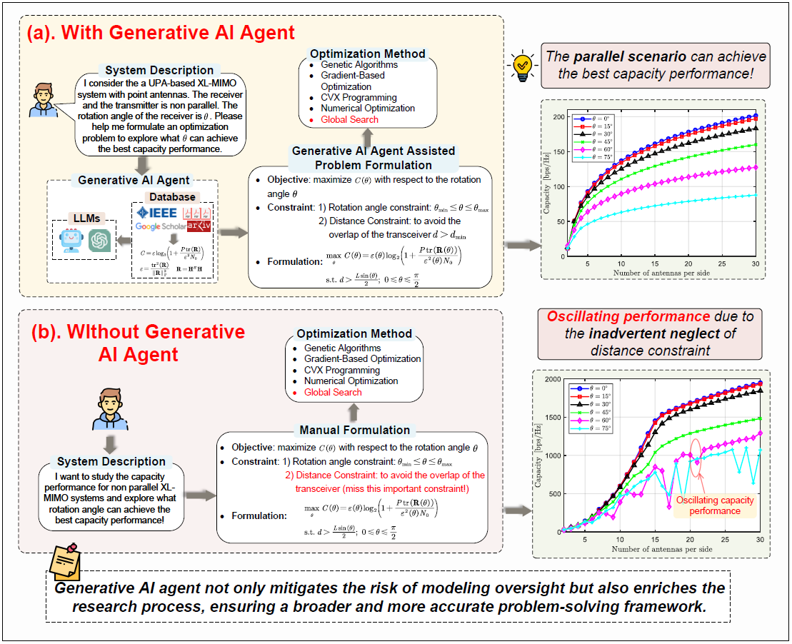

# [GAIMIMO Project]([https://hongyangdu.github.io/MoE4OPT/](https://zhewang77.github.io/GAI_MIMO/))

# 🔴 The code will be made available upon publications.🔴


This repository contains a demo implementation of the algorithm as presented in:

> **"Mixture of Experts for Network Optimization: A Large Language Model-enabled Approach" [Download Paper](https://arxiv.org/pdf/2402.09756.pdf)**


In this part, we representatively provide tutorials for case studies in this paper. For XL-MIMO hardware design, we study UPA-based XL-MIMO with point antennas in case studies.<br>
					
					
					
<h2>🔧 Install Required Packages</h2>
<p>Install the necessary packages one by one using pip:</p>
<pre><code>pip install langchain 
pip install openai 
pip install tiktoken 
pip install chromadb
pip show langchain
</code></pre>		    
<h2>⚡ Setting Up LangChain with Database based on RAG</h2>
<p>Set up LangChain based on <a href="https://github.com/RickyZang/GIAI" target="_blank">this repository</a>. The database is established by merging research papers about the performance analysis of XL-MIMO:
<br>
[1] Z. Wang, J. Zhang, W. Yi, H. Du, D. Niyato, B. Ai, and D. W. K. Ng, "<a href="https://arxiv.org/abs/2401.15280" target="_blank">Analytical framework for effective degrees of freedom in near-field XL-MIMO</a>," arXiv:2401.15280, 2024.
<br>
[2] Z. Xie, Y. Liu, J. Xu, X. Wu, and A. Nallanathan, "<a href="https://arxiv.org/abs/2304.06141" target="_blank">Performance analysis for near-field MIMO: Discrete and continuous aperture antennas</a>," arXiv:2304.06141, 2023.
<br>
[3] S. S. A. Yuan, Z. He, X. Chen, C. Huang, and W. E. I. Sha, "<a href="https://ieeexplore.ieee.org/document/9650519" target="_blank">Electromagnetic effective degree of freedom of an MIMO system in free space</a>," IEEE Antennas Wireless Propagat. Lett., vol. 21, no. 3, pp. 446–450, Mar. 2022.
	    

<h2>🔍 Case Study 1: Capacity Maximization for Non-Parallel Transceiver</h2>
    <p>We formulate the capacity maximization problem for non-parallel tranceiver. The interactive assistance from the generative AI agent can be implemented (an exmaple):</p>
	    
    	
		<p>With the assitance of the generative AI agent, we can study the capacity maximization problem for non-parallel tranceiver. We use Matlab to implement performance evaluation. We consider one square transmitting UPA surface and one square receiving UPA surface with similar physical sizes $10\lambda \times 10\lambda$. The transmitting distances between the center point of the transmitter and the center point of the transmitter for (a) and (b) are $30\lambda$ and $4\lambda$, respectively. And the signal-to-noise ratio (SNR) $P/N_0=10$.</p>	


    <h2>🔍 Case Study 2: EDoF Maximization for Various Shapes of Transceiver</h2>
    <p>We then study the EDoF maximization problem for various shapes of transceiver. The interactive assistance from the generative AI agent can be implemented (an exmaple):</p>
    
    
   

				<p>We can efficiently formulate the EDoF maximization problem for various shapes of transceiver with the assistance of the generative AI agent. We apply Matlab to implement simulation evaluation. We have $L=12\lambda$ and transmitting distance $d=10\lambda$.</p>

    <hr>

## 📚 Cite Our Work

Should our code assist in your research, please acknowledge our work by citing:

```bibtex
@article{du2024mixture,
  title={Mixture of Experts for Network Optimization: A Large Language Model-enabled Approach},
  author={Du, Hongyang and Liu, Guangyuan and Lin, Yijing and Niyato, Dusit and Kang, Jiawen and Xiong, Zehui and Kim, Dong In},
  journal={arXiv preprint arXiv:2402.09756},
  year={2024},
  month = {Feb.}
}
```
